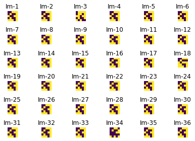

```python

```


```python

```


```python
#Elaborado por Ricardo Gonzalez Garduño
import numpy as np
import matplotlib.pyplot as plt
import random

#Clase para poder evaluar los individuos
class Datos():
    individuo = []
    fitness = 0
    
#Funciones geneticas necesarias
def creaIndividuoInicial(x,y):
    b = np.random.randint(2, size=(y,x))
    return b

#Funciones de procesamiento de imagenes
def muestraImagen(matrizImagen):
    plt.imshow(matrizImagen,vmin=0,vmax=1)
    
#Funcion para recorrer la matriz
def recorreMatrizC(matriz):
    for elemento in np.nditer(matriz, order = 'C'):
        print(elemento, end=' ')
        
#Funcion para convertir una matriz al individuo
def MatrizCadena(matriz):
    m = ""
    for elemento in np.nditer(matriz, order = 'C'):
        m = m+str(elemento)
    return m

#Funcion para convertir una cadena a matriz
def CadenaMatriz(cadena,y,x):
    s = (y,x)
    b = np.random.randint(1, size=(y,x))
    i = 0
    for j in np.arange(b.shape[0]):
        for k in np.arange(b.shape[1]):
            b[j, k] = cadena[i]
            i+=1
    return b

#Esta funcion crea la primera generacion que sera reproducida
def generacionInicial():
    axes=[]
    fig=plt.figure()
    arr = []
    print("Generacion 0")
    for a in range(rows*cols):
        b = np.random.randint(2, size=(height,width))
        arr.append(MatrizCadena(b))
        axes.append(fig.add_subplot(rows, cols, a+1) )
        subplot_title=("Im-"+str(a))
        axes[-1].set_title(subplot_title)  
        axes[-1].axis("off")
        plt.imshow(b)
    fig.tight_layout()    
    plt.show()
    return arr

#Este modulo nos ayuda a regresar los fitness por individuo
def calculaFitness(arr,obj):
    for i in range(0,len(arr)):
        fit = 0
        arr2 = arr[i]
        for j in range(0,len(obj)):
            if(arr2[j]!=obj[j]):
                fit+=1
    fitness.append(fit)
    return fitness

#Este modulo retorna un arreglo de indices con los mejores candidatos para reproducir
def Seleccion(obj,arr,pxC):
    numero = int(pxC*len(arr))
    fitness = []
    aux = []
    mejores = []
    for i in range(0,len(arr)):
        fit = 0
        arr2 = arr[i]
        for j in range(0,len(obj)):
            if(arr2[j]!=obj[j]):
                fit+=1
        fitness.append(fit)
    aux = sorted(fitness)
    for i in range(0,numero):
        mejores.append(fitness.index(aux[i]))
    return mejores

#Esta funcion nos ayuda a cruzar los individuos y nos retorna la nueva generacion
def Cruza(index, arr,pxC):
    aux = []
    lim = int(pxC*len(arr[0]))
    k = 0
    while(len(aux)<len(arr)):
        resp = arr[index[k]]
        for i in range(k+1,len(index)):
            resp2 = arr[index[i]]
            cadena = ""
            for c in range(0,lim):
                cadena+=resp[c]
            for c in range(lim,len(resp)):
                cadena+=resp2[c]
            if(len(aux)<len(arr)):
                aux.append(cadena)
        k += 1
    return aux
            
#Esta funcion nos ayuda a mutar los individuos recien cruzados y nos da la generacion mutada    
def Mutar(pob, pxM, nBitsM):
    numero = int(len(pob)*pxM)
    for i in range(0,numero):
        indice = random.randint(0,len(pob)-1)
        aux = list(pob[indice])
        for j in range(0,nBitsM):
            z=random.randint(0,len(aux)-1)
            if(aux[z]=="0"):
                aux[z]="1"
            else:
                aux[z]="0"
        pob[indice] = ''.join(aux)
    return pob

#Mostrar nueva generacion
def muestraNuevaGeneracion(pobV,h,w,num, fitness):
    axes=[]
    fig=plt.figure()
    arr = []
    print("Generacion ",num)
    for a in range(rows*cols):
        b = CadenaMatriz(pobV[a],h,w)
        axes.append(fig.add_subplot(rows, cols, a+1) )
        subplot_title=("Im-"+str(a+1))
        axes[-1].set_title(subplot_title)  
        axes[-1].axis("off")
        plt.imshow(b)
    fig.tight_layout()    
    plt.show()

#Esta funcion imprime los individuos en su forma de cadena
def imprimePoblacion(arr):
    for i in range(0,len(arr)):
        print(arr[i],"\n")
#Estructora de la imagen y elementos necesarios
width=5
height=5
rows = 6
cols = 6
axes=[]
fig=plt.figure()
poblacion = []

#Parametros geneticos
tPoblacion = rows * cols
pxCruza = 0.7
pxMutacion = 0.1
nBitsMutar = 5

x = width
y = height

#Mascara que sera utilizada como objetivo del algoritmo genetico
a = creaIndividuoInicial(x,y)
print("Objetivo")
#Como luce nuestro objetivo
muestraImagen(a)
objetivo=MatrizCadena(a)
poblacion = generacionInicial()
generaciones = 21000
indices = []
nuevos = []
fitness = []
cont = 1
igual = False
i = 1
while(igual == False):
    indices=Seleccion(objetivo,poblacion,pxCruza)
    nuevos = Cruza(indices,poblacion,pxCruza)
    mutados = Mutar(nuevos, pxMutacion, nBitsMutar)
    poblacion = mutados
    fitness = calculaFitness(poblacion,objetivo)
    for j in range(0,len(fitness)):
        if(fitness[j]==0):
            igual = True
    if(cont == 1000):
        muestraNuevaGeneracion(poblacion,y,x,i,fitness)
        cont = 0
    cont+=1
    i+=1
muestraNuevaGeneracion(poblacion,y,x,i,fitness)
muestraImagen(a)

```

    Objetivo
    Generacion 0
    


    

    


    

    


    Generacion  1000
    


    

    


    Generacion  2000
    


    

    


    Generacion  3000
    


    

    


    Generacion  4000
    


    

    


    Generacion  5000
    


    

    


    Generacion  6000
    


    

    


    Generacion  7000
    


    

    


    Generacion  8000
    


    

    


    Generacion  8748
    


    

    


    

    


```python

```


```python

```
