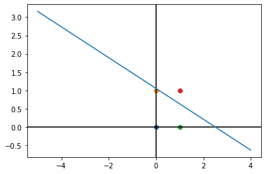

# Perceptrón simple
```python
# Perceptron simple con compuertas AND, OR, NAND Y NOR
# Ricardo Gonzalez Garduño

# Importamos lo necesario

# Numpy nos permite usar matrices y vectores de forma simple
# Random nos ayuda a generar números aleatorios
# Math nos permite realizar operaciones matemáticas
# Matplotlib es para realizar gráficas
# Os nos permite navegar entre directorios de la computadora
# Pandas es útil para utilizar datos de Excel

import numpy as np
import random
import math
import matplotlib.pyplot as plt
import os
import pandas as pd

# Función para recuperar la ruta del archivo que contiene los datos
def buscaRuta(archivo):
    for r, d, f in os.walk("c:\\"):
        for files in f:
            if files == archivo:
                return os.path.join(r,files)

# Función que inicializa el valor aleatorio de los pesos w
def inicializaPesos(vectorDePesos,numeroDePesos):
    for i in range(0,numeroDePesos):
        if(random.randint(0,1) == 1):
            vectorDePesos.append(float(f'{random.uniform(0,1):.2f}'))
        else:
            vectorDePesos.append(float(f'{random.uniform(0,1):.2f}')*-1)
            
# Función de activación de la neurona en este caso se usó la función escalón
def funcionEscalon(opc, xnet, y):
    if(opc < 3):
        if(xnet>=0):
            y = 1
        else:
            y = 0
    else:
        if(xnet<=0):
            y = 0
        else:
            y = 1
    return y

# Función para actualizar los pesos en caso de error wi = wi + alpha * xi * error  
def actualizaPesos(pesos, a, e, x, y):
    print("0PesosV ", pesos)
    pesos[0] += a*x*e
    pesos[1] += a*y*e
    print("1PesosN ", pesos)

# Ruta encontrada del archivo
archivo = 'c:\\Users\\yosoy\\datos2.xlsx'

# Usamos pandas para abrir el archivo excel
archivo_excel = pd.read_excel(archivo)

# Recuperamos los datos del archivo
x1 = archivo_excel['x1'].values
x2 = archivo_excel['x2'].values
vand = archivo_excel['s1'].values
vor = archivo_excel['s2'].values
vnand = archivo_excel['s3'].values
vnor = archivo_excel['s4'].values

# Declaración de variables a utilizar
w = []
xnet = 0
y = 0
error = 0
umbral = 0.2
alpha = 0.1
pos = 0

# Solicitamos qué pesos serán entrenados
# 1. AND
# 2. OR
# 3. NAND
# 4. NOR
opcion = int(input("Selecciona una compuerta 1-4 : "))

# Inicializamos los pesos
inicializaPesos(w,2)

print("Pesos iniciales: ",w)

# Inicializamos contadores
# itera es para contar cada cuatro entradas
# iteraciones cuenta en cuantas iteraciones se encontraron los pesos
itera = 0
iteraciones = 0

# Ciclo en que se ajustaran los pesos hasta que itera sea 4
while(itera<4 ):
    print("--------------------------------------------------------------------------")    
    # Llegan los valores de las compuertas y se suman
    print("Valore entrantes: (",x1[pos]," , ",x2[pos],")")
    xnet = x1[pos]*w[0] + x2[pos]*w[1]
    
    # Se le suma o resta el umbral dependiendo de la compuerta
    if(opcion >2):
        xnet += umbral
    else:
        xnet -= umbral
    
    # Se despliega la suma total de los pesos
    print("Suma Xnet = xi*wi +/- umbral: ",xnet)
    
    # Se activan los valores con la función escalón y se muestra el resultado Ys
    y = funcionEscalon(opcion, xnet, y)
    print("Salida final: ",y)
    
    # Se calcula el error con error = Ye - Ys
    if(opcion == 1):
        error = vand[pos]-y
        print("Salida esperada: ",vand[pos])
    elif(opcion == 2):
        error = vor[pos]-y
        print("Salida esperada: ",vor[pos])
    elif(opcion == 3):
        error = vnand[pos]-y
        print("Salida esperada: ",vnand[pos])
    else:
        error = vnor[pos]-y
        print("Salida esperada: ",vnor[pos])

    #Se imprime el error resultante
    print("Error resultante: ",error)

    # Si el error fue de cero el peso está bien, en caso contrario se ajustará el peso y se realizara de nuevo el cálculo
    if(error != 0):
        actualizaPesos(w, alpha, error, x1[pos], x2[pos])
        print("Nuevos pesos: ",w)
        itera = -1
        
    #Incremento de contadores
    pos+=1
    itera+=1
    iteraciones += 1
    if(pos == 4):
        pos = 0

        
print("*************************************************************************")
print("Pesos finales entrenados ",w)
print("Total de iteraciones: ", iteraciones)
x = np.arange(-5, 5)
# y sera nuestra ecuación lineal
if(opcion > 2):
    recta = -((w[0]/w[1])*x)-(umbral/w[1])
else:
    recta = -((w[0]/w[1])*x)+(umbral/w[1])

#Los metodos axhline y axvline generan las lineas negras en forma de cruz
plt.axhline(0, color="black")
plt.axvline(0, color="black")

#Agregamos los datos de x e y en el grafico y luego lo mostramos
plt.plot(x, recta)
plt.scatter(0, 0)
plt.scatter(0, 1)
plt.scatter(1, 0)
plt.scatter(1, 1)
plt.show()
```

    Selecciona una compuerta 1-4 : 1
    Pesos iniciales:  [-0.32, -0.11]
    --------------------------------------------------------------------------
    Valore entrantes: ( 0  ,  0 )
    Suma Xnet = xi*wi +/- umbral:  -0.2
    Salida final:  0
    Salida esperada:  0
    Error resultante:  0
    --------------------------------------------------------------------------
    Valore entrantes: ( 0  ,  1 )
    Suma Xnet = xi*wi +/- umbral:  -0.31
    Salida final:  0
    Salida esperada:  0
    Error resultante:  0
    --------------------------------------------------------------------------
    Valore entrantes: ( 1  ,  0 )
    Suma Xnet = xi*wi +/- umbral:  -0.52
    Salida final:  0
    Salida esperada:  0
    Error resultante:  0
    --------------------------------------------------------------------------
    Valore entrantes: ( 1  ,  1 )
    Suma Xnet = xi*wi +/- umbral:  -0.63
    Salida final:  0
    Salida esperada:  1
    Error resultante:  1
    0PesosV  [-0.32, -0.11]
    1PesosN  [-0.22, -0.009999999999999995]
    Nuevos pesos:  [-0.22, -0.009999999999999995]
    --------------------------------------------------------------------------
    Valore entrantes: ( 0  ,  0 )
    Suma Xnet = xi*wi +/- umbral:  -0.2
    Salida final:  0
    Salida esperada:  0
    Error resultante:  0
    --------------------------------------------------------------------------
    Valore entrantes: ( 0  ,  1 )
    Suma Xnet = xi*wi +/- umbral:  -0.21000000000000002
    Salida final:  0
    Salida esperada:  0
    Error resultante:  0
    --------------------------------------------------------------------------
    Valore entrantes: ( 1  ,  0 )
    Suma Xnet = xi*wi +/- umbral:  -0.42000000000000004
    Salida final:  0
    Salida esperada:  0
    Error resultante:  0
    --------------------------------------------------------------------------
    Valore entrantes: ( 1  ,  1 )
    Suma Xnet = xi*wi +/- umbral:  -0.43
    Salida final:  0
    Salida esperada:  1
    Error resultante:  1
    0PesosV  [-0.22, -0.009999999999999995]
    1PesosN  [-0.12, 0.09000000000000001]
    Nuevos pesos:  [-0.12, 0.09000000000000001]
    --------------------------------------------------------------------------
    Valore entrantes: ( 0  ,  0 )
    Suma Xnet = xi*wi +/- umbral:  -0.2
    Salida final:  0
    Salida esperada:  0
    Error resultante:  0
    --------------------------------------------------------------------------
    Valore entrantes: ( 0  ,  1 )
    Suma Xnet = xi*wi +/- umbral:  -0.11
    Salida final:  0
    Salida esperada:  0
    Error resultante:  0
    --------------------------------------------------------------------------
    Valore entrantes: ( 1  ,  0 )
    Suma Xnet = xi*wi +/- umbral:  -0.32
    Salida final:  0
    Salida esperada:  0
    Error resultante:  0
    --------------------------------------------------------------------------
    Valore entrantes: ( 1  ,  1 )
    Suma Xnet = xi*wi +/- umbral:  -0.22999999999999998
    Salida final:  0
    Salida esperada:  1
    Error resultante:  1
    0PesosV  [-0.12, 0.09000000000000001]
    1PesosN  [-0.01999999999999999, 0.19]
    Nuevos pesos:  [-0.01999999999999999, 0.19]
    --------------------------------------------------------------------------
    Valore entrantes: ( 0  ,  0 )
    Suma Xnet = xi*wi +/- umbral:  -0.2
    Salida final:  0
    Salida esperada:  0
    Error resultante:  0
    --------------------------------------------------------------------------
    Valore entrantes: ( 0  ,  1 )
    Suma Xnet = xi*wi +/- umbral:  -0.010000000000000009
    Salida final:  0
    Salida esperada:  0
    Error resultante:  0
    --------------------------------------------------------------------------
    Valore entrantes: ( 1  ,  0 )
    Suma Xnet = xi*wi +/- umbral:  -0.22
    Salida final:  0
    Salida esperada:  0
    Error resultante:  0
    --------------------------------------------------------------------------
    Valore entrantes: ( 1  ,  1 )
    Suma Xnet = xi*wi +/- umbral:  -0.03
    Salida final:  0
    Salida esperada:  1
    Error resultante:  1
    0PesosV  [-0.01999999999999999, 0.19]
    1PesosN  [0.08000000000000002, 0.29000000000000004]
    Nuevos pesos:  [0.08000000000000002, 0.29000000000000004]
    --------------------------------------------------------------------------
    Valore entrantes: ( 0  ,  0 )
    Suma Xnet = xi*wi +/- umbral:  -0.2
    Salida final:  0
    Salida esperada:  0
    Error resultante:  0
    --------------------------------------------------------------------------
    Valore entrantes: ( 0  ,  1 )
    Suma Xnet = xi*wi +/- umbral:  0.09000000000000002
    Salida final:  1
    Salida esperada:  0
    Error resultante:  -1
    0PesosV  [0.08000000000000002, 0.29000000000000004]
    1PesosN  [0.08000000000000002, 0.19000000000000003]
    Nuevos pesos:  [0.08000000000000002, 0.19000000000000003]
    --------------------------------------------------------------------------
    Valore entrantes: ( 1  ,  0 )
    Suma Xnet = xi*wi +/- umbral:  -0.12
    Salida final:  0
    Salida esperada:  0
    Error resultante:  0
    --------------------------------------------------------------------------
    Valore entrantes: ( 1  ,  1 )
    Suma Xnet = xi*wi +/- umbral:  0.07
    Salida final:  1
    Salida esperada:  1
    Error resultante:  0
    --------------------------------------------------------------------------
    Valore entrantes: ( 0  ,  0 )
    Suma Xnet = xi*wi +/- umbral:  -0.2
    Salida final:  0
    Salida esperada:  0
    Error resultante:  0
    --------------------------------------------------------------------------
    Valore entrantes: ( 0  ,  1 )
    Suma Xnet = xi*wi +/- umbral:  -0.009999999999999981
    Salida final:  0
    Salida esperada:  0
    Error resultante:  0
    *************************************************************************
    Pesos finales entrenados  [0.08000000000000002, 0.19000000000000003]
    Total de iteraciones:  22
    


    

    


```python

```
